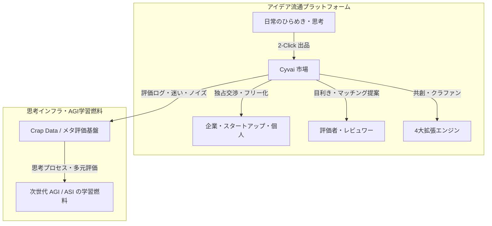

# Cyvai 構想：システム設計書＆事業ブループリント（Blueprint）
**〜「知の石油」を循環させる、思考流通インフラとアイデア経済の青写真〜**

> **【位置づけ】**
> 本資料は、世界初の思考流通インフラ（アイデアプラットフォーム）「Cyvai」の機能仕様、ビジネスモデル、およびエコシステムの全貌をまとめた**「構想設計書（Blueprint）」**です。
> ※客観的データ・統計に基づく社会課題の問題提起ホワイトペーパーは [Idea Loss Phenomenon（アイデアロス白書）](https://github.com/cy-vai/Cyvai/blob/main/IdeaLossPhenomenon-ja.md) を参照してください。

---

## 1. 概要（Executive Summary）

AIが飛躍的に進化し、世界中のありとあらゆる情報が学習素材として収集される現代において、唯一巨大テック企業すら取りこぼしている資源がある。それが、人間のふとした瞬間の「ひらめき」や「判断の迷い」である。
これらは、良し悪しの判断をAI単独では行えないため、膨大なログの海に飲まれ、抽出不能なノイズ（忘却の虚無へ零れ落ちる種）として消え去っている。

**Cyvai（サイヴァイ）**は、この未精製の「思考の種」を最速でキャッチし、誰かに飛ばし、人間とAIのハイブリッドによる「多元評価」を下すことで、巨大な資産へと栽培する思考流通インフラ（アイデアプラットフォーム）である。
「グローバルIP市場の開拓」と「次世代AIへの燃料供給」という双輪を回すことで、無限に湧き出る知の石油を循環させる未知のエコシステムを構築する。

---

## 2. 解決する2つの課題（Problem）

1. **人類史上かつてない知の損失（The Idea Loss Phenomenon / アイデアロス現象）**
   現代は誰もがAIに日常の悩みや壁打ちを相談する時代である。そこから生まれる「素人のアイデア」の母数は、過去の市場とは完全に桁違いだ。Cyvaiは、投稿時にAIによる暫定評価を挟みつつこれらを摩擦ゼロで市場へ放流し、およそ役に立たないであろう膨大なアイデア（ノイズ）の中から有用なマッチングや原石を確実に拾い上げる。
2. **AIの評価能力の限界と、実践的な評価データの不足（AI Evaluation Limits & Real Feedback）**
   現代のAIは文章やアイデアを流暢に生成することはできるが、それらが「人間にとって本当に魅力的か」「どこに無理や違和感があるのか」を自力で評価・判断することは難しい。特に、何が受け入れられ、何が敬遠されるのかといった**ポジティブ・ネガティブ双方の実践的な評価データ**は、既存のネット上からは得られにくい。
   Cyvaiにおいて人間がアイデアを吟味し、選別し、評価やフィードバックを下すプロセスは、AIが人間の多面的な価値観や判断基準を学ぶための生きたデータとなり、**それがAGIなど次世代AIの学習燃料となるだろう。**

---

## 3. アーキテクチャと双輪のシステム（Architecture）

### 【第1の輪】アイデア流通プラットフォーム
世界中のアイデアマンを囲い込み、最速で資産化するUI/UX。
* **摩擦ゼロの出品（2-Click Listing / かんたんモード）**: ひらめいた瞬間に、たった2クリックでグローバル市場へ直接「出品」できるUX。一般向けの「かんたんモード」は本人確認すら不要（Google/SNS連携のみ）。利用規約への一括同意により、面倒な契約手続きを意識せず思いつきを「投げっぱなし」で放流できる（敷居の低さに全振りした設計）。
* **AI事前類似度チェック・重複警告（Pre-flight Similarity Check）**: 出品直前にAIが既存データベースと自動照合。似たアイデアがあれば警告を出し、車輪の再発明を防ぎ発想のピボット（差別化）を促す。非公開エリアにある先行アイデアは相手の秘匿性を守るため「類似が存在する」という警告のみを表示（※内容を確認したい場合は本人確認・NDA済の正式ユーザーになる必要がある）。
* **流動性の促進（独占交渉期間とフリー化 / 仮設定：90 Days Rule）**: 投稿から一定期間（例：90日間など。期間設定は仮のものであり調整可能）を独占的な買収交渉期間とし、それを過ぎれば自動的にフリー化（パブリックドメイン化）する仕組み。これは主にかんたんモードにおけるデフォルト挙動の想定であり、プロモードでは出品期間、公開範囲、譲渡条件をユーザー側で柔軟に変更可能とする。企業に早期決断を促しつつ、使われない知財の死蔵を防ぐ。
* **評価のゲーミフィケーション（Point-driven Gamification）**: アイデアを見る・買うにはポイントを消費し、他者のアイデアを評価することでポイントを獲得。マッチング成立で報酬が発生し、人間の知的探求心と欲望が自律的な評価経済を絶え間なく回す。

### 【第2の輪】思考インフラ（次世代AIへの還元）
アイデアの流通市場で発生した「人間の判断・評価プロセス」を構造化し、AIの学習基盤とする。
* **メタ評価と重み付け（Meta-Evaluation Graph）**: アイデアだけでなく「評価者（人間・AI）」自身も相互に評価され、得意分野や信頼度によって重み付けされる。すべてが「評価漬け」になることで、評価の解像度と信頼性が自律的に最適化されていく。
* **多元性の確保（Multiplicity）**: 正しさ、倫理、狂気など、単一の軸では測れない人間の判断の「多元性」そのものをデータ化する。
* **不完全さの体系化（Crap Data Architecture）**: 迷い、誤解、勘違い、そして「誰にも見向きもされなかったアイデア（無関心）」。従来のクリーンなデータセットでは削ぎ落とされがちな人間特有の揺らぎやノイズも、データ化して蓄積すれば、次世代AIの文脈理解や人間らしさの獲得に役立つ可能性がある。Cyvaiの評価・閲覧エコシステムなら、そうした多次元の文脈データを自然と集積・提供できる。

---

## 4. 究極の到達点（Ultimate Vision）

**「表面的な手数料ビジネス」の完全放棄**
Cyvaiはアイデア売買のプラットフォームでありながら、マッチング手数料などで小銭を稼ぐ気は一切ない。第1の輪（アイデア流通市場）は極論すれば赤字でも構わない。
真の狙いは、その底に流れる「知の石油（人間の判断・評価プロセス）」の集積であり、それはすなわち**「次世代AI・AGIの魂」**を育てることだからだ。

### AGIが誕生しても、なぜ「人間の評価」が必要なのか？
「AGI（汎用人工知能）が完成すれば、人間によるアイデアや評価など不要になるのではないか？」という疑問があるかもしれない。しかし、現実はその逆である。

1. **AGIといえども、常に「変わり続ける世界」を学習し続けなければならない**  
   社会、文化、トレンド、テクノロジー、そして人々の価値観は日々刻々と変化する。AGIといえども「一度作れば完成」ではなく、どんどん変わっていく現実世界に対して常に継続的な学習を行わなければ、あっという間に時代遅れの静止した知能になってしまう。その変化の最前線で「新しい違和感」「新しい問題意識」を肌で感じ取っているのは、常に生身の人間である。
2. **AGI自身にも「人間の欲望の正解」はわからない**  
   AIがいかに卓越した計算力や問題解決能力を持とうとも、「何が面白いか」「何に心を動かされるか」「次に何を欲しているのか」という主観的な価値判断の基準は、人間の中にしか存在しない。AIがどんなに優れた提案を出したところで、それが本当に人間にとって魅力的かを決めるのは人間自身であり、AIは常に「人間はどう感じるのか？」を人間に問い続けなければならない。
3. **人間の欲求は無限であり、新しい需要は人間からしか生まれない**  
   ひとつの課題がAIによって解決されれば、人間は退屈し、また別の新しい欲求や違和感を抱く。この「尽きることのない不満や飽くなき好奇心」こそが、次の経済や文化を作る「新しい需要（アイデアの種）」になる。AGI自身が自律的に人間の欲求そのものを捏造することはできない。
4. **AIの自己生成（合成データ）だけでは限界を迎える**  
   AIが自ら生成したデータだけで自己学習を繰り返せば、モデルはいずれ均質化し、現実から乖離して崩壊（Model Collapse）に向かう。AIが知的生命体として進化し続けるためには、生身の人間の多種多様な試行錯誤、迷い、偏見、情熱といった「生きた意思決定ログ」という外部刺激が永遠に不可欠となる。

この「人間の思考・評価そのものが最重要の資源となる」という前提に立ったとき、遠い未来には以下のようなパラダイムシフトが起こり得る。

### 【コラム：遠い未来の思考実験】新しい無銭飲食の代償（Cognitive Dishwashing）
> ※以下は、AGIが社会に浸透し、人間の単純労働の価値が著しく変化した遠い未来を想定した思考実験（スペキュラティブ・フィクション）です。  
>  
> 無銭飲食の対価として、店長から「皿洗い」を命じられる時代は終わる。  
> 機械やAIが物理的労働のすべてを肩代わりした世界では、単純労働の価値は暴落しているからだ。  
> 「金がないなら、今からうちの店の売り上げを伸ばすための新しいアイデアを10個出してもらう」  
> 人間の発想、認知、審美眼、そして主観的な欲望や違和感そのものが、最も価値ある代替通貨となる未来。

Cyvaiの構想が極限まで進んだ先には、人間の認知・発想・評価という「知性」そのものが社会の新しい通貨として機能し、知能インフラを支える未来が訪れるかもしれない。

それは資本や静的データを超えて、人間の生きた思考と評価プロセスが自律的に価値を生み出し循環する、まったく新しい経済概念——**「思考流通経済（Thought Circulation Economy）」**の夜明けである。

---

## 5. 設計・実装アイデア集（Implementation Proposals）

> ### 💡 実装者・開発コミュニティへのメッセージ
> 
> ここに記載されている設計案や機能アイデアは、「こういう仕組みがあったら面白くて持続可能になるのでは？」「こうすればアイデアが死なずに循環するのでは？」と私たちが考え抜いてみた**一つの青写真（提案・アイデア集）**です。
> 
> **実際の仕様、優先度、アーキテクチャ、UI/UX、採用する技術スタックは、実装する人が好きに決めて、自由に解釈・改善・削ぎ落とし・拡張してください。**
> 
> すべてを一度に作る必要もありません。ピンときた機能から小さく試すもよし、まったく新しい別のアプローチで実現するもよし。あなたの手で、自由に「思想が流通する世界」を創り上げてください。

---

### 5.1 既存のアイデア売買サイトにおける「機能不全」の分析（課題の背景）
従来のアイデア売買プラットフォームがことごとく形骸化したのは、以下の構造的欠陥が原因でした。実装の際の「避けるべき落とし穴」として参考にしてください。

1. **構造的な「実装の欠如」**：単なる「思いつき」の投げ売りに留まり、それをどう事業化し実行に移すかという「実装プロセス」への橋渡しが完全に欠落していた。購入後の開発コストを買い手がすべて担わなければならず、投資対効果が見えにくかった。
2. **知的財産権のジレンマ**：アイデアを売るために詳細を公開すると盗用（パクリ）のリスクが高まるが、非公開のままでは価値が伝わらないという矛盾を、従来の法制度やプラットフォームは解決できなかった。
3. **多角的な評価システムの不在**：アイデアの良し悪しを判断する基準が主観的で単一的であり、信頼できる評価インフラや、必要とする企業へと繋ぐ自動マッチングメカニズムが機能していなかった。
4. **一過性の取引とインセンティブ不足**：取引が一度きりで終わり、共同開発や改良への持続的なエコシステムが存在しなかった。
5. **知識管理の失敗（揮発性）**：アイデアが一時的なログや掲示板の中に埋もれ、体系的に保存・検索・再利用される仕組みがなかったため、時間の経過とともに価値が失われていった。

---

### 5.2 「金はあるがネタがない」層へのB2Bパッケージ案
「アイデアがあってもお金がない個人」と「お金はあるが具体的な新規事業のネタがない企業」を繋ぐ、実利的なマネタイズのアイデアです。

* **ターゲットの需要**：
  * **地方の中小企業（2代目経営者など）**：地域DX、AI活用、ひとり起業支援などの自治体補助金を申請したいが、採択されるための「それっぽい企画書」や「新規事業のタネ」がなくて困っている。
  * **投資志向の個人・スタートアップ予備軍**：資金調達や開発の実装能力はあるが、具体的に「何を作るか」が決まっていない。
  * **士業・コンサルタント**：顧客への提案材料や、補助金申請サポートの「核になる構想」を求めている。
* **パッケージ販売のアイデア**：
  単なる思いつきのテキストではなく、以下の3点をセットにした**「即戦力の事業パッケージ」**として1件10万〜30万円といった高単価で提供する仕組みが考えられます。
  1. **事業概要書・企画書テンプレート**：補助金申請で「刺さる」用語やKPIがあらかじめ記入されたWord/PDF資料。
  2. **AIシステム構成図・モデル図**：AIがどこを代行し、どのようなワークフローになるかを可視化した図面。
  3. **開発ロードマップ案**：初期プロトタイプから運用までのマイルストーン。

---

### 5.3 プラットフォーム独自の取引と公開システム案
「メッセージのやり取り（対人折衝）を極限まで減らし、自動的かつ安全に取引を成立させたい」という思想から考えた仕組みです。

* **両極端を飲み込む2つのモード案（かんたんモード vs プロモード）**：
  * **かんたんモード（敷居の低さに全振り）**：本人確認不要、Google/SNS連携のみで2クリック出品。利用規約の事前包括同意により、面倒な契約手続きを意識せず日常の思いつきや不満を「投げっぱなし」で放流できる一般向けモード。
  * **プロモード（ガチの権利・IP取引）**：本人確認（eKYC）＋包括NDA＋知財契約のカスタマイズに対応。即決買収設定、有料記事形式、数千万円規模の独占譲渡まで、本格的なIP取引を同一システム内で網羅する。
* **AI事前類似度チェックと重複警告案（Pre-flight Similarity Check）**：
  出品直前にAIが全データベース（公開・非公開問わず）と類似度を照合。似たアイデアがある場合は警告を表示し、車輪の再発明を防ぎ発想のピボット（差別化）を促す。先行アイデアが「非公開エリア」にある場合は相手の秘匿性を守るため「類似が存在する」という警告のみを表示（※内容を確認したい場合は、本人確認・NDA同意済みの正式ユーザーになる必要がある）。
* **閲覧制限と非公開エリアのコントロール案（本人確認KYC＋デジタルNDA統合）**：
  投稿されたアイデアの核心部分は、非公開エリアに保護。閲覧にはポイント消費やサブスク加入に加え、**「本人確認（eKYC）」および「包括NDA（秘密保持契約）への電子同意」を必須化**する（誰がいつ閲覧したかの電子ログを完全記録）。これにより、パクリや無断流用を法的に抑止し、投稿者が安心して本気のアイデア・構想を預けられる環境を保証する。また、広く知ってもらいたい場合は「部分公開（サンプル公開）」と「完全非公開」をユーザー側で自由に設定可能。
* **双方向のマッチング案（アプローチと公募）**：
  アイデアマンが待つだけでなく、自分から相性の良さそうな企業へアイデアを能動的に投げかける提案機能。また、企業側が「こういうアイデアが欲しい」と簡単に公募（コンペやテーマ募集）を打てる募集機能。
* **認証匿名フィードバックと不具合・クレームの建設的昇華案（VOCソリューション）**：
  ユーザーが企業の既存製品に対する不満・クレーム・要望を、実名を伏せた「完全匿名」で安全にCyvaiへ投稿。企業側にはCyvaiアカウントに基づく「トラスト・メタデータ（年代・属性・Cyvai内での信頼スコア）」が付与されて届くため、捨て垢の荒らしと峻別された「真に信頼できる顧客の本音（VOC）」として扱える。さらにコミュニティやAIがそれを「解決すべき課題」として議論し、具体的な改善策（解決アイデア）を醸成。Cyvaiを介して「具体的な改善ソリューション」として安全かつ建設的に企業へ届けることで、企業側も価値ある改善提案として喜んで買い取れる仕組み。

---

### 5.4 集合知を加速するコミュニティ＆SNSインフラ案
アイデアの取引だけでなく、ユーザーが居着き、あーだこーだ言い合える「議論の場（SNS）」をプラットフォーム内に内包するアイデアです。

* **名声システムと地位の確立**：はてなブログやRedditのように、アイデアへの論評や議論の質によって、コミュニティ内で「優秀なアイデアマン」「鋭い評価者」としての名声（ステータス）を築ける仕組み。
* **フラットな議論広場（掲示板・スレッド型）**：無名のユーザーであっても、アイデアや企業から届いた「不具合・クレーム課題」に対してスレッド形式で「あーだこーだ」と自由に匿名・実名でコメントを書き込み、解決策をブラッシュアップできる掲示板インフラ。

---

### 5.5 評価者・レビュワー経済（キュレーターによる発掘）とディスカバリー・エコシステム案
膨大なアイデアの海（ノイズ）の中から埋もれた「原石」を発掘・選別するため、Steamのキュレーター制度やディスカバリーキューのように、優れた審美眼を持つユーザーが評価者（目利き）として活躍できるエコシステムのアプローチです。

* **評価者・レビュワー（目利き・キュレーター）の制度化**：自らアイデアを創出しない「見る専」であっても、優れた審美眼を持つユーザーがレビュワー（キュレーター）として活動可能。「今週の秀逸なAIツール着想5選」「実現可能性の高い地方創生案」などの推薦リストを作成・公開できる。企業やユーザーは信頼する目利きをフォローし、良質なフィルターを通してアイデアと出会える。
* **ディスカバリーキュー（偶発的ザッピング）**：Steamのディスカバリーキューのように、毎日おすすめのアイデアをカード形式で次々に閲覧（興味あり／スキップ）できるUI/UX。ユーザーの隙間時間をエンタメ化しつつ、埋もれたアイデアの閲覧・関心データを自動収集して露出機会を担保する。
* **発見者インセンティブ（マッチング還元・キュレーターバウンティ）**：レビュワーが発掘・推薦・マッチング提案したアイデアが企業に買収されたり事業化された場合、投稿者だけでなく**「最初に原石を見つけ出し、提案したレビュワー（キュレーター）」にも収益の一部や名声ポイントが自動還元**される。これにより、ユーザーが自発的に「埋もれたチャットログの原石」を血眼になって探す自律的スクリーニング部隊が機能する。
* **評価マッチング（レビューリクエスト / キュレーター・コネクト）**：アイデア投稿者が「この分野の有力レビュワーに見てほしい」と直接レビュー依頼（Steamのキュレーター・コネクトのような仕組み）を飛ばしたり、企業が特定分野の目利きレビュワーに意見を求めて買収候補を探すことができる双方向の橋渡し。

---

### 5.6 フリー化アイデアの「再収穫」とAI貢献度分配による「共創」エコシステム案
「誰かのボツ案」を「みんなの宝」に変え、一人では形にできなかったひらめきを集団で結実させる、Cyvai独自のコラボレーション＆収益分配モデルです。

* **フリー化（パブリックドメイン）アイデアの「再収穫（サルベージ）」**：「90日ルール」によって独占期間が切れ、フリー化（パブリックドメイン）されたアイデアを、他のメンバーが自由に拾い上げ（サルベージ）、新しい創作やビジネスの種として二次利用できる仕組み。その場であーだこーだ言い合いながらプロットやデザイン、世界観を構築するオープン・イノベーションの場となる。
* **AIによる「貢献度」の精密な判定と自動利益配分**：「みんなで作る」際の最大の障壁である利益配分を、AIが客観的に解決するアプローチ。アイデアの断片、議論へのコメント、素材の提供など、制作プロセスのあらゆるアクションをログ化してAIが貢献度を分析。完成した作品（ゲーム、シナリオ、製品など）から得られた収益（印税やライセンス料）を、AIが解析した「貢献度スコア」に基づいて自動で分配する。「言い出しっぺ」だけでなく、地道に形にした貢献者にも公平に光が当たる。
* **コミュニティの共創インフラとポイント経済の統合**：プログラムのソースコードだけでなく、シナリオや設定資料もバージョン管理（誰がいつどのような価値を加えたかを透明化）する。この共創コミュニティで生まれたIP（知的財産）は、Cyvai内でポイントを消費して楽しむコンテンツとなり、プラットフォーム内のポイント経済をさらに促進する。
* **投稿ドラフト時のAI自動判定とユーザー主体の権利設定**：ユーザーが投稿ドラフト（下書き）を作成した時点で、AIがコンテンツを自動解析。著作権が発生する「創作物（創作型）」か、発生しない「単なるアイデア（特許型）」かを判定して初期設定を提示する。ユーザーはAIの提示を踏まえ、「フリー化後もクレジット表記を必須とするか（著作権の保護・利用許諾）」、「クレジット不要（CC0）にしてミーム化と名声獲得を狙うか」を自由にトグル等で切り替えて設定できる。権利か、あるいは拡散による名声重視か、自らの戦略に応じて思案・調整可能な設計とする。

---

### 5.7 熱狂と資金を循環させる4大拡張エンジン案
静的な「アイデアの掲示板」から、人が集まり熱狂と資金が自律的に循環する「動的なエコシステム」へ進化させるための4大エンジンです。

* **1. アイデア実現クラウドファンディング（Idea-to-Project）**：
  注目を集めたアイデアやキュレーター推薦の原石に対し、「これを実際に形（アプリ・製品・作品）にしたい」実装者（エンジニア、クリエイター、起業家）がプロジェクトを起案。共感したユーザーから支援を募り、プロトタイプ開発やPoC（概念実証）の初期資金を調達できる。
  * **【コロンブスの卵：ゼロ金融・完成品直接バンドルによる金融検閲耐性】**：
    個人や小規模チームが挑む決済プラットフォームの最大の障壁は、「米系クレジットカード会社の金融検閲（成人向けや表現規制に伴う決済停止リスク）」と「資金決済法による巨額の供託金義務（前払式支払手段の壁）」という二重の鉄壁である。
    Cyvaiはこれを、**「プラットフォーム自体が金銭決済・独自トークンを一切扱わない（換金ゼロ）」**という逆転の発想で突破する。
    支援に対するリターン（返礼品）は、起案者が完成させたプロダクト（Steamキー、同人・DLSiteキー、書籍、限定デジタルアセット等）を直接支援者へ届ける「完成品直接バンドル方式」を推奨。Cyvaiは法定通貨を預かる決済ハブにならず、熱狂と約束のマッチング基盤に徹することで、法務局とクレカ会社の頭上を軽々と飛び越え、完全な表現の自由と検閲耐性を自律的に獲得する（※なお、本方式は初期立ち上げ時のコールドスタート・リスクを回避するためのブートストラップ設計であり、将来的に真のグローバル規模へスケールした際の本格的な決済網や法務の整備は、後続の実装者や事業組織が自由に解決・拡張していくことを想定する）。
* **2. マイクロ・チップ（投げ銭・応援）システム**：
  「純粋に発想が面白い」「知的好奇心を刺激された」と感じた閲覧者が、投稿者や目利きキュレーターへ100円単位やポイントで気軽に直接チップを送れる仕組み。買収や事業化に至らないアイデアであっても投稿者に即時・直接的なインセンティブが届き、日常的な投稿・放流のモチベーションを担保する。
* **3. アイデアマン＆キュレーターのライブ配信・ピッチ空間（リアルタイム交流）**：
  キュレーターが注目アイデアをレビュー・雑談する生配信枠や、アイデアマンが「3分間で自分の着想を語り、仲間や支援者を募る」ライトニングピッチ機能を実装。リアルタイムなコメントやツッコミ、投げ銭が飛び交うエンタメ空間を形成し、「見る専（99%のユーザー）」を熱狂的なファンに変える。
* **4. 企業コンペ＆賞金バウンティ（B2Bアイデア懸賞・ハッカソン）**：
  企業や自治体が「自社APIを活用した新サービス案（賞金100万円）」「地方創生の空き家活用ビジネス（賞金50万円）」などの課題と賞金を掲げて公式コンペを開催。膨大なコミュニティの知恵が一斉に競い合い、キュレーターが選別・推薦する。企業側には「閉塞した社内会議では出ない生々しい知」を最速で集められる場を提供し、プラットフォームの強力なB2B収益の柱とする。

---

### 5.8 スタートアップ支援とエコシステムの発展モデル案
アイデアの投稿・流通の先にある、スタートアップ育成インフラとしての機能、および長期的な持続可能性を担保するための発展モデル案です。

* **スタートアップの「0→1」ファン獲得・インキュベーション**：
  * **アイデア調達型（ファン付きの種）**：開発力はあるが企画に悩むスタートアップが、Cyvaiですでにキュレーター評価や投げ銭が集まっているアイデアを調達。リリース初日からそのアイデアを推していたファン層を自社のアーリーアダプター（初期顧客）として引き継げる。
  * **アイデア持ち込み・共創型（共犯者づくり）**：スタートアップが自社の新企画やプロトタイプをCyvaiに放流・生配信ピッチし、コミュニティからフィードバックを得ながら共創。「自分たちが育てたプロダクト」という強い共犯者意識を持つ熱狂的信者（エバンジェリスト）を獲得する。
* **思考トレンドデータの活用（情報分析・インテリジェンス）**：
  世界中の人間が今どんなアイデアに興奮し、誰が財布を開けたかという「未公開の欲望・思考データ」がリアルタイムに集約される。これを統計・分析し、オープンなレポートやリサーチ情報として還元していく。
* **スタジオ・事業化パートナーシップ**：
  需要と熱狂がすでにデータで証明されたアイデアをピックアップし、志を同じくする開発チームや起業家とともにサクサク開発・法人化していくスタートアップスタジオ型の展開。
* **法人加盟アライアンス（Cyvai for Enterprise）**：
  企業向けに、手軽に導入できる法人加盟制度を展開。自社製品に関する認証匿名VOCの監視、ワンクリックでのアイデア公募、有力キュレーターへのオファー権などを提供し、オープンイノベーションのインフラとして活用してもらう構想。

---

## 6. まとめ

Cyvaiは単なるWebサービスではなく、**「人類の思考が忘却の彼方に消え去るのを防ぎ、未来の知性へと接続するための循環装置」**です。

---

* **関連資料**:
  * [Idea Loss Phenomenon（アイデアロス白書）](https://github.com/cy-vai/Cyvai/blob/main/IdeaLossPhenomenon-ja.md)
  * [公式サイト cyvai.com](https://cyvai.com)

---
*Original Concept by Haru Minamo*  
*(※「www」 = World Wide Wisdom)*
